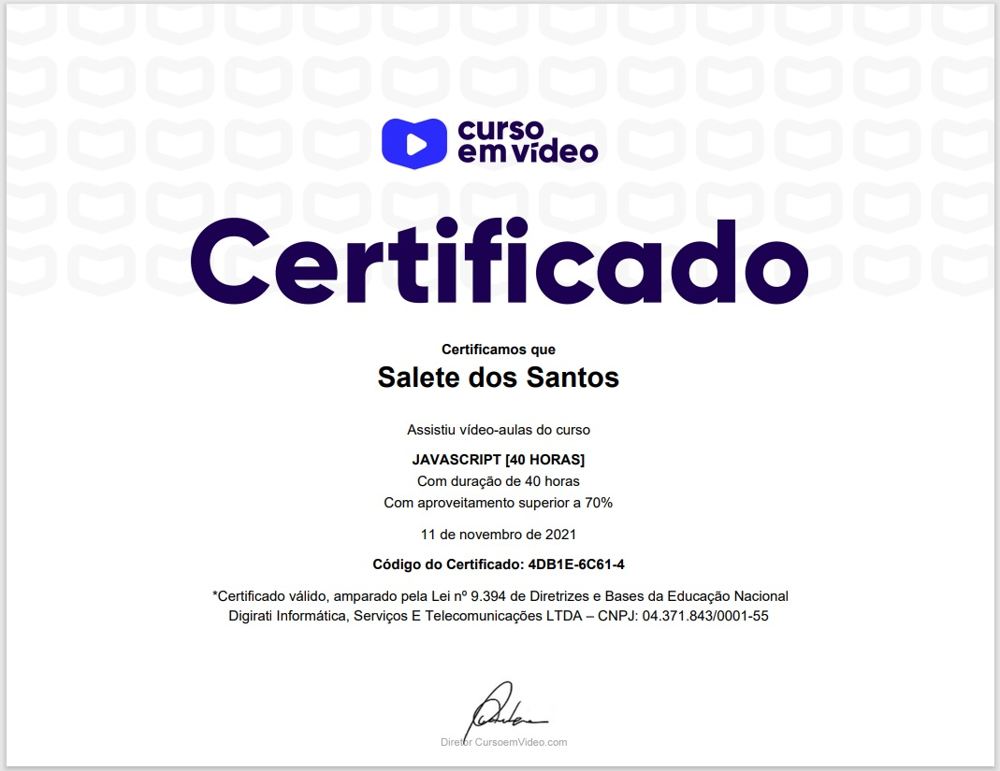

# Curso de JavaScript do Curso em Vídeo
### Atividades e desafios do curso de JavaScipt do Curso em Vídeo com o **profº Gustavo Guanabara**

**Desafios**     
   1. Desafio das Mensagens
   2. Boas vindas! :grinning:
   3. Antes e Depois
   4. Calculando o troco
   5. Conversor de Medidas
   6. Conversor de Temperaturas
   7. Conversor de Monetário
   8. Calcular desconto
   9. Reajuste salarial
   10. Resolvendo Bhaskara
   11. Ano Bissexto
   12. Preço mudou
   13. Situação do aluno

**Mais exercícios**
1.   Olá Mundo!
2.   Botão
3.   Uso de dados
4.   Uso de dados II
5.   Dobro e metade
6.   Soma
7.   Média

**Projetos Aula** 
Exercícios feitos durante as aulas
 
## Certificado  

